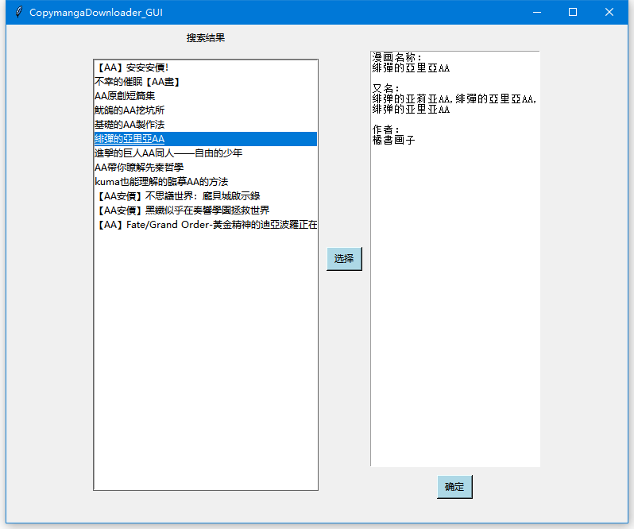
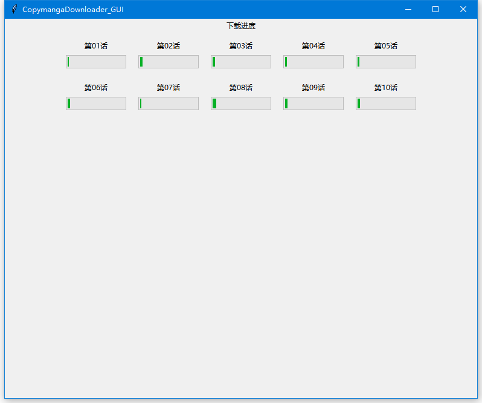

# CopymangaDownloader


## 声明

此工具仅为个人学习交流制作使用，请不要将此工具用于商业用途，也不要恶意长时间大范围使用以免造成服务器负担或者造成服务器限制。出现上述状况均与本人无关。

## 简介

新加入图形界面，再也不用对着cmd输出了

此工具使用 `python`下载Copymanga中的漫画，以jpg的形式保存于电脑中

无需打开网页，直接搜索想看的漫画，并支持指定范围下载

如果发现无法连接/下载的时候，请多试几次，确保域名输入正确

## 如何使用 

### 注意：由于pycryptodome的原因，目前本工具只测试Windows系统中的使用情况，Linux用户可以在安装pycrypto之后尝试使用。

0. 小白用户右转在Releases里下载或者下载仓库后找到exe文件直接打开使用

0.1 GUI版本由于各种原因打开速度会比较慢，打开时请有点耐心

1. clone本仓库或者直接打包下载

2. 确保你安装了python 3.8或以上版本

3. cd至本工具的目录并使用pip install -r requirements.txt安装所需依赖

4. 使用python打开CopymangaDownloader.py（如命令行执行 python ./CopymangaDownloader.py）

4.1 你也可以打开CopymangaDownloader_GUI.py来使用GUI版本通过命令行中的报错来发现问题所在

5. 按照提示搜索输入自己想要的结果

6.好好享受！

## 使用截图





## 更新

2022/8/19: 上传第一版

2022/8/22: 修复了部分漫画拉取章节列表失败、替换有效地址不起作用的问题

2022/9/27: 加入多线程下载

2022/9/29: 加入了图形界面测试版程序

## 应该不会再有的未来更新

* 发现BUG就修一下

*偶尔会出现json解析错误无法下载的问题，等待调查后修复

## 关于api

此工具所使用的所有资料获取的API均为官方API。
使用到的API如下

```text
漫画搜索：
https://api.copymanga.site/api/kb/web/searchs/comics?offset=0&platform=2&limit=12&q={搜索词}

漫画章节获取：
https://api.copymanga.site/api/v3/comic/{漫画path_word}/chapters

漫画每章图片获取：
https://api.copymanga.site/api/v3/comic/{漫画path_word}/chapter/{章节UUID}

```

## 使用过程中出现了问题？

* 找不到下载的漫画在哪？由于使用了相对目录，查看命令提示行执行时的所选目录可能会有帮助

* 下载的速度实在是太慢了怎么办？如果你需要下载多个章节不放试试手动多线程（同时开数个本工具下载不同章节），若是下载没速度尝试检查你的网络连接，或者有可能是短时间内下载频繁导致服务器暂时封禁

* 出现的问题上面没给出解决方案？可以在issue中给我留言，我会抽空查看处理。
* 也欢迎各位pull requests来提升本工具的使用体验，

## 特别感谢

* [ZhuFN's Blog](https://zhufn.fun/archives/cpmgapi/)提供了章节列表解密的方法
* [copymanga-helper](https://github.com/Byaidu/copymanga-helper)参考了一些实现方式
